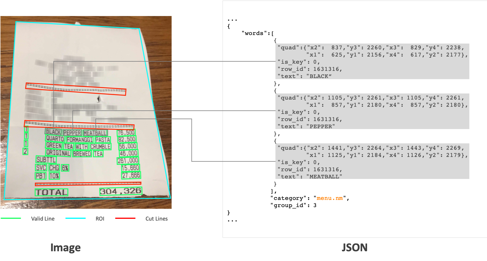

# CORD: A Consolidated Receipt Dataset for Post-OCR Parsing

We introduce a novel dataset called **CORD**, which stands for a **CO**nsolidated **R**eceipt **D**ataset for post-OCR parsing.



### Abstract [[paper](https://openreview.net/pdf?id=SJl3z659UH)]
OCR is inevitably linked to NLP since its final output is in text. Advances in document intelligence are driving the need for a unified technology that integrates OCR with various NLP tasks, especially semantic parsing. Since OCR and semantic parsing have been studied as separate tasks so far, the datasets for each task on their own are rich, while those for the integrated post-OCR parsing tasks are relatively insufficient. In this study, we publish a consolidated dataset for receipt parsing as the first step towards post-OCR parsing tasks. The dataset consists of thousands of Indonesian receipts, which contains images and box/text annotations for OCR, and multi-level semantic labels for parsing. The proposed dataset can be used to address various OCR and parsing tasks.


## Updates
- 1,000 sample dataset will be available soon. Some class labels shown in the original paper were removed due to Indonesian legal issues. In particular, the ```store_info```, ```payment_info```, and ```etc``` fields have been removed from the target class to be published. [20191212]


## Key Features
- Large Scale: over 11,000 Indonesian receipts collected from shops and restaurants
- Fine-grained classes: five superclass and 42 subclass labels
- Multi hierarchy: includes group annotations
- Additional information: line group (```row_id```), region of interest (```roi```), cut lines (```repeating_symbol```), and ```is_key``` flag


## Data Specification (for the whole dataset)

### Class Definition

| No | Category       | Tag field (subclasses)   | Description                               |
|----|----------------|--------------------------|-------------------------------------------|
| 1  | menu (16)      | menu.nm                  | name of menu                              |
| 2  |                | menu.num                 | identification # of menu                  |
| 3  |                | menu.unitprice           | unit price of menu                        |
| 4  |                | menu.cnt                 | quantity of menu                          |
| 5  |                | menu.discountprice       | discounted price of menu                  |
| 6  |                | menu.price               | total price of menu                       |
| 7  |                | menu.itemsubtotal        | price of each menu after discount applied |
| 8  |                | menu.vatyn               | whether the price includes tax or not     |
| 9  |                | menu.etc                 | others                                    |
| 10 |                | menu.sub_nm              | name of submenu                           |
| 11 |                | menu.sub_num             | identification # of submenu               |
| 12 |                | menu.sub_unitprice       | unit price of submenu                     |
| 13 |                | menu.sub_cnt             | quantity of submenu                       |
| 14 |                | menu.sub_discountprice   | discounted price of submenu               |
| 15 |                | menu.sub_price           | total price of submenu                    |
| 16 |                | menu.sub_etc             | others                                    |
| 17 | void menu (6)  | voidmenu.nm              | name of menu                              |
| 18 |                | voidmenu.num             | identification # of menu                  |
| 19 |                | voidmenu.unitprice       | unit price of menu                        |
| 20 |                | voidmenu.cnt             | quantity of menu                          |
| 21 |                | voidmenu.price           | total price of menu                       |
| 22 |                | voidmenu.etc             | others                                    |
| 23 | subtotal (8)   | subtotal.subtotal_price  | subtotal price                            |
| 24 |                | subtotal.discount_price  | discounted price in total                 |
| 25 |                | subtotal.subtotal_count  | Total number of items                     |
| 26 |                | subtotal.service_price   | service charge                            |
| 27 |                | subtotal.othersvc_price  | added charge other than service charge    |
| 28 |                | subtotal.tax_price       | tax amount                                |
| 29 |                | subtotal.tax_and_service | tax + service                             |
| 30 |                | subtotal.etc             | others                                    |
| 31 | void total (4) | voidtotal.subtotal_price | void subtotal price                       |
| 32 |                | voidtotal.tax_price      | void tax price                            |
| 33 |                | voidtotal.total_price    | total void price                          |
| 34 |                | voidtotal.etc            | void etc information                      |
| 35 | total (8)      | total.total_price        | total price                               |
| 36 |                | total.total_etc          | others                                    |
| 37 |                | total.cashprice          | amount of price paid in cash              |
| 38 |                | total.changeprice        | amount of change in cash                  |
| 39 |                | total.creditcardprice    | amount of price paid in credit/debit card |
| 40 |                | total.emoneyprice        | amount of price paid in emoney, point     |
| 41 |                | total.menutype_cnt       | total count of type of menu               |
| 42 |                | total.menuqty_cnt        | total count of quantity                   |


### Json Hierarchy

| Attribute Name   |            |        | Description                                                |
|------------------|------------|--------|------------------------------------------------------------|
| valid_line       | words      | quad   | Four coordinates of quadrilateral                          |
|                  |            | is_key | Flag to indicates the text used as a key or not            |
|                  |            | row_id | Line index                                                 |
|                  |            | text   | Incorporating text of the corresponding box                |
|                  | category   |        | Parse class label                                          |
|                  | group_id   |        | Group id to which the valid_line belongs                   |
| ---------------- | ---------- | ------ | ---------------------------------------------------------- |
| meta             | version    |        | Dataset version                                            |
|                  | image_id   |        | Corresponding image id                                     |
|                  | split      |        | 'train' or 'dev' or 'test'                                 |
|                  | image_size |        | Size of the image (by pixel)                               |
| ---------------- | ---------- | ------ | ---------------------------------------------------------- |
| roi              |            |        | Four coordinates that encompass the area of receipt region |
| ---------------- | ---------- | ------ | ---------------------------------------------------------- |
| repeating_symbol | quad       |        | Four coordinates of quadrilateral                          |
|                  | text       |        | = or - or .                                                |


## Download Link

| No | Name | Total | # train | # dev  | # test | release date |
| -- | -- | -- | -- | -- | -- | -- |
| 0 | [sample]() | 1,000 | 800 | 100 | 100 | 6 Dec 2019 |


## Citation

### CORD: A Consolidated Receipt Dataset for Post-OCR Parsing
```
@article{park2019cord,
  title={CORD: A Consolidated Receipt Dataset for Post-OCR Parsing},
  author={Park, Seunghyun and Shin, Seung and Lee, Bado and Lee, Junyeop and Surh, Jaeheung and Seo, Minjoon and Lee, Hwalsuk}
  booktitle={Document Intelligence Workshop at Neural Information Processing Systems}
  year={2019}
}
```
### Post-OCR parsing: building simple and robust parser via BIO tagging

```
@article{hwang2019post,
  title={Post-OCR parsing: building simple and robust parser via BIO tagging},
  author={Hwang, Wonseok and Kim, Seonghyeon and Yim, Jinyeong and Seo, Minjoon and Park, Seunghyun and Park, Sungrae and Lee, Junyeop and Lee, Bado and Lee, Hwalsuk}
  booktitle={Document Intelligence Workshop at Neural Information Processing Systems}
  year={2019}
}
```


## License
```
Copyright (c) 2019-present NAVER Corp.

Permission is hereby granted, free of charge, to any person obtaining a copy
of this software and associated documentation files (the "Software"), to deal
in the Software without restriction, including without limitation the rights
to use, copy, modify, merge, publish, distribute, sublicense, and/or sell
copies of the Software, and to permit persons to whom the Software is
furnished to do so, subject to the following conditions:

The above copyright notice and this permission notice shall be included in
all copies or substantial portions of the Software.

THE SOFTWARE IS PROVIDED "AS IS", WITHOUT WARRANTY OF ANY KIND, EXPRESS OR
IMPLIED, INCLUDING BUT NOT LIMITED TO THE WARRANTIES OF MERCHANTABILITY,
FITNESS FOR A PARTICULAR PURPOSE AND NONINFRINGEMENT.  IN NO EVENT SHALL THE
AUTHORS OR COPYRIGHT HOLDERS BE LIABLE FOR ANY CLAIM, DAMAGES OR OTHER
LIABILITY, WHETHER IN AN ACTION OF CONTRACT, TORT OR OTHERWISE, ARISING FROM,
OUT OF OR IN CONNECTION WITH THE SOFTWARE OR THE USE OR OTHER DEALINGS IN
THE SOFTWARE.
```
